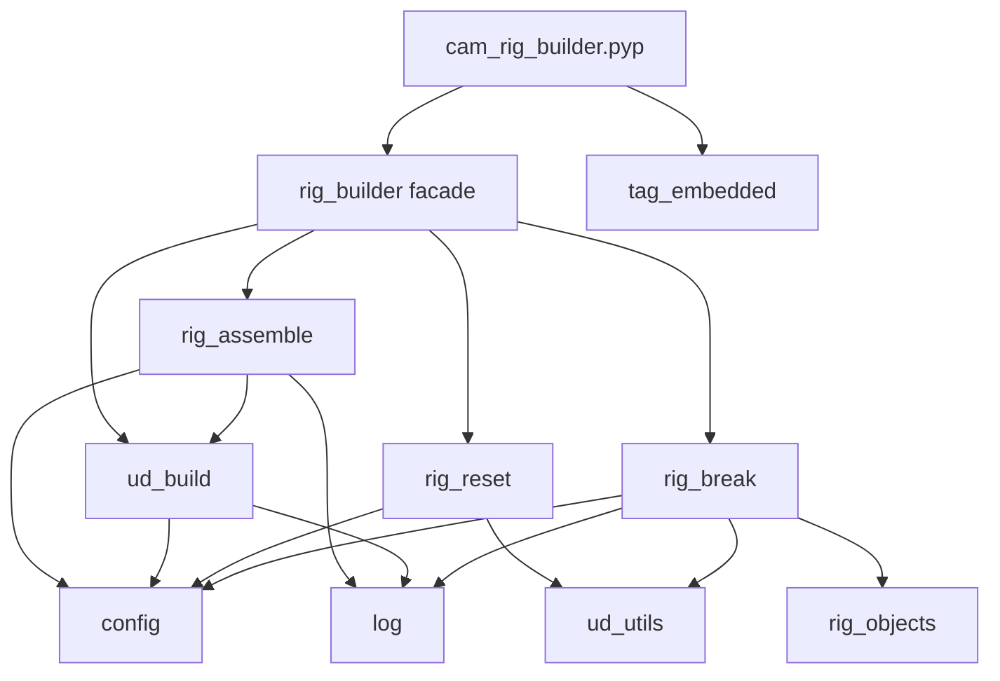

# CamRig — архитектура модулей

Версия плагина: `camrig/config.py` → `PLUGIN_VERSION`. Портируемый рантайм сцены: `camrig/tag_embedded.py` → `EMBEDDED_RUNTIME_VERSION` (должны совпадать; проверка при загрузке [`cam_rig_builder.pyp`](../cam_rig_builder.pyp)).

## Граница «пакет vs embedded Python Tag»

| Зона | Где живёт код |
|------|----------------|
| Разрешение иерархии орбитального рига в кадре, чтение UD, orbit/shake/target/focal | **`tag_embedded.py`** — полный текст копируется в `TPYTHON_CODE`; **не импортирует** пакет `camrig`. Дублируются строковые имена UD и логика `get_rig_objects`, совместимая с **`rig_objects.py`**. |
| Разрешение объектов для Break, сообщения об ошибках в Script Log | **`rig_objects.py`** |
| Сборка объектов сцены, UD из JSON, Reset, Break | Публичный вход — **`rig_builder.py`** (фасад); реализация — `rig_assemble`, `ud_build`, `rig_reset`, `rig_break`. |

При изменении имён UD или цепочки Follow→Offset обновляйте **и** `config.py` / шаблон, **и** `tag_embedded.py`, **и** при необходимости `rig_objects.py`.

## Зависимости модулей (упрощённо)

- **`ud_utils.py`** — безопасное чтение `DESC_NAME` для элементов UD.
- **`log.py`** — префикс `[CamRig]` для Script Log.
- **`user_data.py`** — точечное чтение значения UD по имени (через `ud_utils`).
- **`ud_build.py`** — примитивы UD, загрузка `ud_template.json`, `validate_ud_template_vs_config()` при старте плагина.

Обзор поведения см. [`SUMMARY.md`](SUMMARY.md).
