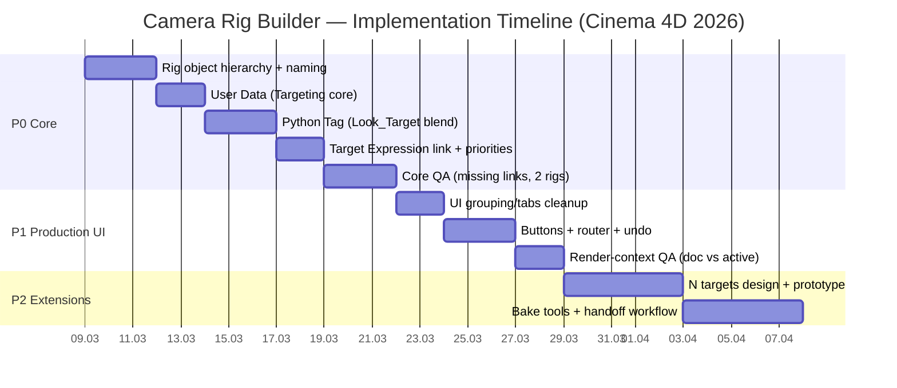

# Техническое задание на Camera Rig Builder для Cinema 4D 2026

## Executive summary

Цель документа — зафиксировать единое, продакшн‑готовое ТЗ на **камера‑риг для Cinema 4D 2026**, ориентированное одновременно на **разработчиков** (реализация/тесты/совместимость) и **аниматоров** (понятный UI, предсказуемая анимация, быстрый workflow). Риг создаётся командой/плагином *Cam Rig Builder* и предоставляет один основной контроллер **Main_Camera**, на котором сосредоточены **User Data** (слайдеры, чекбоксы, ссылки и кнопки) и **Python Tag**, вычисляющий служебные элементы в Expression‑цикле. citeturn2search0turn0search1

Критический функционал P0 — система **плавного перевода взгляда**: камера смотрит на виртуальный объект **Look_Target**, позиция которого вычисляется смешиванием двух целей (**Target A** и **Target B**) по параметру **Target Blend**. Логика выполняется в Python Tag и должна быть устойчивой к отсутствующим ссылкам, множественным вызовам `main()` за кадр и рендер‑контексту (когда узлы выполняются не в активном документе). citeturn0search1turn3search4turn3search0

Совместимость: Cinema 4D 2026.1 использует встроенный CPython 3.11 (на Windows/Mac указан Python 3.11.4) и классический Python API (модуль `c4d`). citeturn1search7turn1search0  
Рендер: если используется Redshift, риг должен быть совместим как со стандартной C4D‑камерой, так и с native Redshift Camera, при этом следует учитывать, что **Redshift Camera Tag объявлен устаревшим для новых проектов**, и в новых сценах предпочтительнее native RS Camera Object. citeturn1search17turn1search6

## Цели, приоритеты и совместимость

Риг предназначен для:
- постановочной анимации камеры (движение/кадрирование/перевод взгляда),
- удобного управления из одного контроллера,
- расширения в будущем до нескольких таргетов (N‑таргетная система). citeturn2search0

Приоритеты:

**P0 (обязательно в первом релизе)**  
Риг создаётся одной командой, создаёт иерархию, выставляет связи, и обеспечивается работа **Look Blend** (Target A/B → Look_Target → Target Expression). Python Tag реализует устойчивую логику на каждом обновлении сцены. citeturn0search1turn2search8

**P1 (важно для продакшна)**  
Полноценная спецификация UI: группы/вкладки, валидные дефолты, безопасные кнопки (Snap/Reset/Assign/Build), корректный Undo для командных кнопок, отсутствие спама в консоль (warn‑once), корректные приоритеты Expression (Python Tag должен отрабатывать раньше Target Expression). citeturn0search1turn4search0turn0search23

**P2 (следующий релиз/расширения)**  
N‑таргеты с весами, доп. режимы (damping/lag), baking утилиты, пресеты операторского поведения.

Совместимость и ограничения:

- Встроенный интерпретатор Cinema 4D **не идентичен** “обычному” CPython на машине: он основан на CPython, но имеет ограничения и особенности (особенно для C‑расширений). citeturn1search0
- Python Tag `main()` **может вызываться несколько раз за кадр**, поэтому код должен быть лёгким и идемпотентным: без тяжёлых поисков по сцене “каждый вызов” и без накопительных побочных эффектов. citeturn0search1
- В NodeData‑контексте (включая Python Tag) **нельзя опираться на активный документ**: поведение при рендере/в нескольких документах требует использовать документ узла (`doc` / `GeListNode.GetDocument()`), а не `c4d.documents.GetActiveDocument()`. citeturn3search4turn3search0
- Если Redshift активен: доступны разные “типы камер” и workflow с тегом/объектом; нужно предусмотреть совместимость и не ломать старые сцены. citeturn1search11turn1search17

Применяемые официальные источники/практики разработки: документация Python SDK 2026 и официальный репозиторий примеров API от entity["company","Maxon","3d software company"]. citeturn1search9turn1search24

## Состав рига и иерархия объектов

Риг создаётся плагином/командой *Cam Rig Builder* и вставляется в документ как единый контейнер. Имена объектов считаются частью спецификации (используются для дефолтного резолва, если ссылки User Data пустые).

Рекомендуемая иерархия:

```
Cam_Rig (Null)                      [root]
├── Target_A (Null)                 [default target A]
├── Target_B (Null)                 [default target B]
├── Look_Target (Null)              [virtual target; driven by Python Tag]
└── Main_Camera (Controller)        [User Data + Python Tag]
    └── Follow (Null)               [internal motion node]
        └── Offset (Null)           [internal offset node]
            └── RS_CAM (Camera)     [render camera; Target Expression → Look_Target]
                └── FX_CAM (Camera) [optional effects stage: shake/noise]
```

Назначение ключевых узлов:

- **Main_Camera**: единственный объект, с которым работает аниматор. Хостит UI (User Data) и Python Tag.  
- **Look_Target**: “виртуальная цель”, на которую смотрит камера; именно его позиция вычисляется логикой.  
- **Target_A / Target_B**: дефолтные цели; могут быть заменены ссылками в User Data на любые объекты сцены (персонажи, нулы, точки и т.п.).  
- **RS_CAM**: основная камера. На ней расположен **Target Expression**, направленный на Look_Target. (Точный набор тегов может различаться в зависимости от студийного стандарта, но Target Expression — обязательный.)  
- **FX_CAM**: опциональный слой для эффектов (например, shake), чтобы вторичка не “ломала” базовую анимацию.  

Координатная политика:

- Смешивание целей должно производиться **в мировых координатах**, потому что Target A и Target B могут находиться в разных ветках иерархии. Это означает использование `BaseObject.GetMg()` (world matrix) и запись через `BaseObject.SetMg()`. citeturn2search8turn2search4
- В Python API важно помнить: поля матрицы (`mg.off`, `mg.v1` и т.п.) возвращают **копии**, поэтому менять `mg.off.x = ...` нельзя (не сработает). Нужно присваивать вектор целиком: `mg.off = newVector`, затем `SetMg(mg)`. citeturn5view0

Redshift примечание (если применяется):

- В новых проектах Redshift рекомендует **native Redshift Camera Object**, а Redshift Camera Tag помечен как устаревший; при смешении “native RS camera” и “C4D camera + RS Camera Tag” тег может терять функцию и требовать конвертации. citeturn1search17turn1search6
- Для таргетинга RS Camera на практике требуется добавить Target Tag/Target Expression (опция “target” становится доступной при наличии соответствующего тега). citeturn1search22

## Спецификация User Data и UI контроллера

### Принципы UI

- Все параметры UI размещаются на **Main_Camera** как User Data (“одна точка управления”). citeturn2search0  
- UI организуется в группы/вкладки, чтобы аниматор быстро находил нужное: Motion, Offset, Rotation, Lens, Targeting, FX, Utilities.
- Параметры, которые анимируются, должны быть **Float/Integer/Bool**. Кнопки (Button) используются только для **команд**, а не для состояния/анимации. `Button` не хранит значение как “параметр”. Практически это реализуется через сообщения `MSG_DESCRIPTION_COMMAND`. citeturn0search12turn0search18turn2search0

### Таблица User Data параметров

Колонки: **Имя**, **Группа**, **Тип**, **Диапазон**, **Default**, **Можно ли анимировать**, **Поведение при анимации**, **Поведение при отсутствии ссылки/объекта**, **Примечания**.  
Замечание: точные `DescID`/внутренние UserData‑ID *не фиксируются* в ТЗ (они зависят от порядка создания User Data) и должны резолвиться по имени или быть жёстко заданными генератором интерфейса. Это отмечается как *unspecified*. citeturn3search2turn3search6

| Имя | Группа | Тип | Диапазон | Default | Можно ли анимировать | Поведение при анимации | Поведение при отсутствии ссылки/объекта | Примечания |
|---|---|---|---:|---:|---|---|---|---|
| Rig Enable | Utilities | Bool | On/Off | On | Да | Отключение/включение вычислений Python Tag; при Off значение Look_Target “заморожено” | Не зависит от ссылок | P0: удобный мастер‑переключатель |
| Debug Log | Utilities | Bool | On/Off | Off | Нет (не требуется) | Не влияет на риг, только на вывод диагностик | — | P1: warn‑once без спама |
| Target A | Targeting | Link | object | Target_A (внутри Cam_Rig) | Нет | Смена ссылки допускается в любой момент, результат обновляется сразу | Если пусто/невалидно: fallback — найти `Target_A`; если нет — не менять Look_Target и (опц.) предупредить | P0: база |
| Target B | Targeting | Link | object | Target_B (внутри Cam_Rig) | Нет | Смена ссылки допускается в любой момент | Если пусто/невалидно и Use Target B=On: fallback — `Target_B`; если нет — подставить Target A | P0 |
| Use Target B | Targeting | Bool | On/Off | Off | Да | При анимации: на кадрах Off игнорировать Blend и B | При On и отсутствии B — fallback на A | P0 |
| Target Blend | Targeting | Float (Slider) | 0–100 | 0 | Да | Поддерживает ключи и F‑Curves; интерполяция должна быть непрерывной | Если Use Target B=Off или B невалиден — параметр игнорируется (взгляд на A) | P0 |
| Orbit | Motion | Float (Slider) | unspecified | 0 | Да | Стандартная анимация | Не зависит от ссылок | P1: если Motion уже реализован — сохранить имена/диапазоны “как есть” (unspecified) |
| Radius | Motion | Float (Slider) | unspecified | unspecified | Да | Стандартная анимация | — | “unspecified”: диапазон зависит от сцены |
| Height | Motion | Float | unspecified | 0 | Да | Стандартная анимация | — | — |
| Follow Position | Motion | Float (Slider) | 0–100 | 0 | Да | Стандартная анимация | — | Если есть Align to Spline/Follow |
| Offset X | Offset | Float | unspecified | 0 | Да | Стандартная анимация | — | Локальные смещения |
| Offset Y | Offset | Float | unspecified | 0 | Да | Стандартная анимация | — | — |
| Offset Z | Offset | Float | unspecified | 0 | Да | Стандартная анимация | — | — |
| Heading | Rotation | Float | -180–180 (deg) | 0 | Да | Стандартная анимация | — | При необходимости конвертации градусов/радиан — определить в реализации (unspecified) |
| Pitch | Rotation | Float | -180–180 (deg) | 0 | Да | Стандартная анимация | — | — |
| Bank | Rotation | Float | -180–180 (deg) | 0 | Да | Стандартная анимация | — | — |
| Focal Length | Lens | Float | 10–300 (mm) | 35 | Да | Стандартная анимация | — | Если управляется на RS_CAM — требуется привязка (unspecified) |
| Shake Enable | FX | Bool | On/Off | Off | Да | Допускается анимация включения/выключения | — | Реализация зависит от FX_CAM/тегов (unspecified) |
| Shake Amount | FX | Float | 0–unspecified | 0 | Да | Стандартная анимация | — | — |

### Таблица кнопок UI

Колонки: **Кнопка**, **Действие**, **Псевдокод/скрипт**, **Undoable**, **Как обеспечить Undo**.  
Кнопки обязаны работать через механизм сообщений `MSG_DESCRIPTION_COMMAND` (см. раздел про Python Tag). citeturn0search12turn0search1

| Кнопка | Действие | Псевдокод/скрипт | Undoable | Как обеспечить Undo |
|---|---|---|---|---|
| Snap to A | Установить Blend=0 | `TargetBlend = 0` | Да | `doc.StartUndo(); doc.AddUndo(UNDOTYPE_CHANGE, ctrl); set value; doc.EndUndo()` citeturn4search0turn4search4 |
| Snap to B | Установить Blend=100 (если UseTargetB=On) | `if UseTargetB: TargetBlend = 100` | Да | Аналогично Snap to A citeturn4search0turn4search4 |
| Assign A from Selection | Записать Target A = выбранный объект | `TargetA = doc.GetActiveObjects()[0]` | Да | `AddUndo(CHANGE, ctrl)` перед записью ссылки citeturn4search4turn4search0 |
| Assign B from Selection | Записать Target B = выбранный объект | `TargetB = doc.GetActiveObjects()[0]` | Да | Аналогично Assign A citeturn4search4turn4search0 |
| Reset Offsets | Обнулить Offset X/Y/Z | `OffsetX=0; OffsetY=0; OffsetZ=0` | Да | `AddUndo(CHANGE, ctrl)`; если меняются внутренние объекты — отдельные `AddUndo(CHANGE, obj)` citeturn4search4turn4search0 |
| Create Default Targets | Создать Target_A/B/Look_Target, если отсутствуют | `if missing: create nulls; parent under Cam_Rig` | Да | Для новых объектов: `AddUndo(NEWOBJ, obj)` после вставки в документ; для изменений: `AddUndo(CHANGE, obj)` до изменений citeturn4search4turn4search0 |

Примечание по Undo: в C++‑документации подчёркнуто, что `AddUndo()` **должен вызываться до изменения**, за исключением сценариев “создание и вставка нового объекта”, где Undo на новый объект добавляется после вставки, но до последующих действий. citeturn4search4

### Зафиксированный баг по UI-кнопкам

**Симптом:** после сборки рига кнопки присутствовали в `Manage User Data`, но в `Attribute Manager` выглядело так, будто они “не создались” или “пропали”.

**Причина:** проблема была в слое отображения `User Data`, а не в самой генерации параметров. Для кнопочных элементов требуется корректное описание как `DTYPE_BUTTON`; дополнительно их нельзя скрывать в описании (`DESC_HIDE = False`). Визуальную путаницу усиливало то, что кнопки находились внутри секции `User Data` и вложенной группы (`Reset`/`Utilities`), поэтому при свёрнутой группе создавалось ложное впечатление, что кнопок нет.

**Практический вывод для реализации и QA:** если кнопка есть в `Manage User Data`, но не видна в `Attribute Manager`, сначала нужно проверять не `message()`/`MSG_DESCRIPTION_COMMAND`, а корректность дескриптора UI (`DTYPE_BUTTON`, `DESC_HIDE`, `DESC_PARENTGROUP`) и состояние раскрытия соответствующей группы в интерфейсе.

## Алгоритм работы и Python Tag

### Модель исполнения и приоритеты Expression

Python Tag предоставляет `main()` и `message(id, data)` (и др.). Важное для рига:
- `main()` соответствует `Execute` и **может вызываться многократно за кадр**. citeturn0search1
- `message(id, data)` соответствует `Message` и вызывается при получении сообщений (в т.ч. нажатия кнопок). citeturn0search1turn0search18

Переменные окружения:
- `op` в Python Tag указывает на сам тег, а документ узла доступен через `doc` (то же, что `op.GetDocument()`), и это корректно для рендера/неактивных документов. citeturn3search0turn3search4
- Объект‑хост (`Main_Camera`) нужно получать через `op.GetObject()` / `BaseTag.GetObject()`. citeturn3search32

Требование по приоритетам:
- Python Tag должен вычислять **Look_Target до того**, как Target Expression вычислит ориентацию камеры.  
- На практике это делается настройкой `c4d.EXPRESSION_PRIORITY` (тип `PriorityData`) на соответствующих тегах. citeturn0search23turn0search2
- Внутри одного priority‑цикла порядок обычно определяется от меньшего числового приоритета к большему (классическая практика, описанная разработчиком). citeturn0search26

Рекомендуемая настройка (требует проверки на реальной сцене):
- `Main_Camera` Python Tag: Cycle = Expression, Priority = 0
- `RS_CAM` Target Expression: Cycle = Expression, Priority = 10  
Цель — исключить “лаг на 1 кадр” при анимации Blend.

### Алгоритм Look_Target для двух таргетов

Определения:
- `PosA = worldPos(TargetA)`
- `PosB = worldPos(TargetB)`
- `t = clamp(TargetBlend/100, 0..1)`

Логика:
- Если `Use Target B = Off`: `Look = PosA`
- Если `Use Target B = On`: `Look = (1-t)*PosA + t*PosB`

Обязательные правила реализации:
- Использовать **world matrix**: `obj.GetMg()` и `SetMg()` (позиция = `mg.off`). citeturn2search8turn2search4
- При записи позиции помнить, что `mg.off` — копия: присваивать целиком `mg.off = newVector`, затем `SetMg(mg)`. citeturn5view0

Псевдокод (ядро):

```
if not RigEnable: return

resolve Look_Target
resolve TargetA (link or default)
if not TargetA: return (warn-once)

if not UseTargetB:
    Look_Target.worldPos = TargetA.worldPos
else:
    resolve TargetB (link or default)
    if not TargetB: TargetB = TargetA (warn-once)
    t = clamp(Blend/100)
    Look_Target.worldPos = lerp(TargetA.worldPos, TargetB.worldPos, t)
```

### Обработка кнопок User Data в Python Tag

#### Механизм сообщений

Сообщения — это “event‑like” ядро Classic API: сообщение имеет `id` (тип сообщения) и сопровождающие данные `data`, квалифицирующие событие. citeturn0search18  
Для кнопок (Button‑элементов описания) используется:
- `c4d.MSG_DESCRIPTION_COMMAND` — “sent for button description elements”. citeturn0search12

В Python Tag это принимается через:

```python
def message(id, data):
    ...
```

и необходимо фильтровать:

```python
if id == c4d.MSG_DESCRIPTION_COMMAND:
    ...
```

Python Tag официально поддерживает override `message(id, data)` и описывает его назначение. citeturn0search1

#### Как получить DescID нажатой кнопки

На практике `data` содержит `DescID` элемента (кнопки). В обсуждениях SDK показано, что данные содержат “description ID of the button”, и его извлекают из контейнера `data` (например, `data['id']`). citeturn4search6turn0search12turn4search28

Однако формат может различаться (иногда используется `data["id"]`, иногда `data["descid"]`, глубина `DescID` может быть разной). Поэтому требуется безопасная обработка:
- проверять наличие ключа,
- проверять глубину `DescID` перед обращением к уровням, чтобы не ловить `IndexError`; для этого рекомендуется `DescID.GetDepth()` и проверки глубины. citeturn4search21

Также полезный практический инструмент: найти ID/DescID элемента можно через drag‑and‑drop параметра из Attributes Manager в Python Console (официально описано для описаний/элементов). citeturn0search31

#### Рекомендации по безопасности: warn-once, debounce, router

**warn‑once**  
Если кнопка запускает команду, которая может не сработать (нет выбора, нет TargetA, нет Cam_Rig), ошибки должны логироваться “один раз” (или с ограничением частоты), иначе консоль быстро превращается в шум.

**debounce**  
UI‑события иногда могут приходить повторно при обновлении интерфейса. Дебаунс можно реализовать как “не выполнять одну и ту же команду повторно в пределах одного кадра” (ключ: `descKey + currentFrame`). Специфика каждого проекта может требовать корректировки, но базовая защита рекомендована для кнопок, меняющих структуру сцены/создающих объекты.

**router**  
Для удобства сопровождения: сделать `router = {buttonKey: handlerFunc}` и вызывать обработчик по ключу нажатой кнопки.  
Ключом предпочтительно сделать не “сырой `DescID`” (он может быть не hashable), а сериализованный tuple уровней (например, `[level.id for level in descid]`).

**кеширование DescID**  
User Data не имеет фиксированных ID “по определению” (они зависят от порядка создания), поэтому в риге правильнее:
- искать нужные User Data элементы по `DESC_NAME` в `GetUserDataContainer()` и кешировать найденные `DescID`. citeturn3search2turn3search6

### Готовый Python Tag код

Ниже — единый код для вставки в Python Tag на `Main_Camera`. Он включает:
- Look_Target blending (2 таргета, Use Target B, Blend 0–100),
- резолв “дефолтных” Target_A/Target_B/Look_Target внутри своего Cam_Rig,
- обработку кнопок через `message()` и `MSG_DESCRIPTION_COMMAND`,
- warn‑once и простой debounce,
- Undo для команд‑кнопок (StartUndo/AddUndo/EndUndo). citeturn0search1turn0search12turn4search0turn4search4

> Важно: имена User Data (“Rig Enable”, “Target Blend”, …) здесь заданы строками и должны совпасть с реальными `DESC_NAME`. Если имена в вашей сцене уже отличаются — это *unspecified* и должно быть приведено в соответствие при внедрении. citeturn3search2turn2search0

```python
import c4d

# ============================================================
# Camera Rig Builder — Python Tag
# Cinema 4D 2026 (Python 3.11)
#
# Features:
# - Two-target Look blending (Target A / Target B) into Look_Target
# - Robust missing-link handling + default object fallback in Cam_Rig
# - Button handling via MSG_DESCRIPTION_COMMAND (message())
# - warn-once + trivial debounce
# - Undo support for UI commands (StartUndo/AddUndo/EndUndo)
#
# Place this Python Tag on: Main_Camera
# ============================================================

# -----------------------------
# CONFIG: expected User Data names (DESC_NAME)
# Adjust ONLY if your existing UD names differ.
# -----------------------------
UD_RIG_ENABLE   = "Rig Enable"
UD_DEBUG_LOG    = "Debug Log"

UD_TARGET_A     = "Target A"
UD_TARGET_B     = "Target B"
UD_USE_TARGET_B = "Use Target B"
UD_TARGET_BLEND = "Target Blend"

# Buttons (User Data type: Button)
UD_BTN_SNAP_A   = "Snap to A"
UD_BTN_SNAP_B   = "Snap to B"
UD_BTN_ASSIGN_A = "Assign A from Selection"
UD_BTN_ASSIGN_B = "Assign B from Selection"
UD_BTN_RESET_OFFSETS = "Reset Offsets"
UD_BTN_CREATE_DEFAULTS = "Create Default Targets"

# Optional offsets stored on controller (if you keep them as User Data)
UD_OFFSET_X = "Offset X"
UD_OFFSET_Y = "Offset Y"
UD_OFFSET_Z = "Offset Z"

# -----------------------------
# CONFIG: default rig object names (inside Cam_Rig)
# -----------------------------
NAME_RIG_ROOT = "Cam_Rig"
NAME_LOOK     = "Look_Target"
NAME_DEF_A    = "Target_A"
NAME_DEF_B    = "Target_B"

# -----------------------------
# Internal caches
# -----------------------------
_CACHE = {
    "ud_desc": {},            # ud_name -> DescID|None
    "ud_key": {},             # ud_name -> tuple(int)|None (DescID serialized)
    "warned": set(),          # warn-once messages
    "last_cmd": None,         # (cmd_key, frame) for debounce
    "rig_root": None,         # cached Cam_Rig pointer
    "look": None,             # cached Look_Target pointer
    "def_a": None,            # cached Target_A pointer
    "def_b": None,            # cached Target_B pointer
}

# ============================================================
# Utility helpers
# ============================================================

def _is_obj(x) -> bool:
    return isinstance(x, c4d.BaseObject)

def _warn_once(msg: str, debug: bool) -> None:
    if not debug:
        return
    if msg in _CACHE["warned"]:
        return
    _CACHE["warned"].add(msg)
    print("[CamRig] " + msg)

def _find_ud_descid(host: c4d.BaseObject, ud_name: str):
    """Find User Data DescID by display name (DESC_NAME)."""
    for desc_id, bc in host.GetUserDataContainer():
        try:
            if bc[c4d.DESC_NAME] == ud_name:
                return desc_id
        except Exception:
            pass
    return None

def _descid_to_key(descid) -> tuple | None:
    """Convert DescID to a hashable key (tuple of level ids)."""
    try:
        # c4d.DescID supports GetDepth() and index access to DescLevel.
        depth = descid.GetDepth()
        return tuple(descid[i].id for i in range(depth))
    except Exception:
        # Fallback: best-effort for other representations
        try:
            return tuple(getattr(lvl, "id", None) for lvl in descid)
        except Exception:
            return None

def _get_ud(host: c4d.BaseObject, ud_name: str, default=None):
    """Get User Data value by name with cached DescID lookup."""
    if ud_name not in _CACHE["ud_desc"]:
        descid = _find_ud_descid(host, ud_name)
        _CACHE["ud_desc"][ud_name] = descid
        _CACHE["ud_key"][ud_name] = _descid_to_key(descid) if descid else None

    descid = _CACHE["ud_desc"][ud_name]
    if descid is None:
        return default

    try:
        return host[descid]
    except Exception:
        return default

def _set_ud(host: c4d.BaseObject, ud_name: str, value) -> bool:
    """Set User Data by name (no EventAdd here; caller decides)."""
    if ud_name not in _CACHE["ud_desc"]:
        descid = _find_ud_descid(host, ud_name)
        _CACHE["ud_desc"][ud_name] = descid
        _CACHE["ud_key"][ud_name] = _descid_to_key(descid) if descid else None

    descid = _CACHE["ud_desc"][ud_name]
    if descid is None:
        return False

    try:
        host[descid] = value
        return True
    except Exception:
        return False

def _find_rig_root(ctrl: c4d.BaseObject) -> c4d.BaseObject | None:
    """Walk upwards to find Cam_Rig root by name."""
    o = ctrl
    while o:
        if o.GetName() == NAME_RIG_ROOT:
            return o
        o = o.GetUp()
    return None

def _find_child_by_name(root: c4d.BaseObject, name: str) -> c4d.BaseObject | None:
    """Depth-first search for the first child with a given name under root."""
    if root is None:
        return None

    stack = []
    d = root.GetDown()
    if d:
        stack.append(d)

    while stack:
        o = stack.pop()
        while o:
            if o.GetName() == name:
                return o
            child = o.GetDown()
            if child:
                stack.append(child)
            o = o.GetNext()

    return None

def _resolve_rig_objects(ctrl: c4d.BaseObject, debug: bool) -> None:
    """Resolve/cache Cam_Rig, Look_Target, default targets."""
    rig_root = _CACHE["rig_root"]
    if rig_root is None or rig_root.GetDocument() is None:
        rig_root = _find_rig_root(ctrl)
        _CACHE["rig_root"] = rig_root

    if rig_root is None:
        _CACHE["look"] = None
        _CACHE["def_a"] = None
        _CACHE["def_b"] = None
        _warn_once(f"Не найден '{NAME_RIG_ROOT}' вверх по иерархии от Main_Camera.", debug)
        return

    look = _CACHE["look"]
    if look is None or look.GetDocument() is None:
        look = _find_child_by_name(rig_root, NAME_LOOK)
        _CACHE["look"] = look

    def_a = _CACHE["def_a"]
    if def_a is None or def_a.GetDocument() is None:
        def_a = _find_child_by_name(rig_root, NAME_DEF_A)
        _CACHE["def_a"] = def_a

    def_b = _CACHE["def_b"]
    if def_b is None or def_b.GetDocument() is None:
        def_b = _find_child_by_name(rig_root, NAME_DEF_B)
        _CACHE["def_b"] = def_b

def _clamp01(x: float) -> float:
    if x < 0.0:
        return 0.0
    if x > 1.0:
        return 1.0
    return x

def _lerp(a: c4d.Vector, b: c4d.Vector, t: float) -> c4d.Vector:
    return a * (1.0 - t) + b * t

def _get_world_pos(obj: c4d.BaseObject) -> c4d.Vector:
    # Note: GetMg() returns a copy, mg.off is a copy too; safe for reading.
    mg = obj.GetMg()
    return mg.off

def _set_world_pos(obj: c4d.BaseObject, pos: c4d.Vector) -> None:
    mg = obj.GetMg()
    mg.off = pos
    obj.SetMg(mg)

# ============================================================
# Button handling (message)
# ============================================================

def _extract_descid(data):
    """Try to extract DescID from message data for button events."""
    # Common patterns seen in practice: data["id"] or data["descid"]
    try:
        return data["id"]
    except Exception:
        pass
    try:
        return data["descid"]
    except Exception:
        pass
    return None

def _current_frame() -> int:
    """Return current document frame for debounce."""
    fps = doc.GetFps()
    return doc.GetTime().GetFrame(fps)

def _debounced(cmd_key: tuple | None) -> bool:
    """Return True if this command should be ignored due to debounce."""
    if not cmd_key:
        return False
    fr = _current_frame()
    last = _CACHE["last_cmd"]
    if last == (cmd_key, fr):
        return True
    _CACHE["last_cmd"] = (cmd_key, fr)
    return False

def _with_undo(ctrl: c4d.BaseObject, changes_fn):
    """Utility: wrap changes in a single undo step."""
    # IMPORTANT: Keep this lightweight; called from message().
    doc.StartUndo()
    # For parameter changes on ctrl itself, we register CHANGE on ctrl.
    doc.AddUndo(c4d.UNDOTYPE_CHANGE, ctrl)
    changes_fn()
    doc.EndUndo()
    c4d.EventAdd()

def _handle_button(ctrl: c4d.BaseObject, button_ud_name: str, debug: bool):
    """Execute action associated with a button UD name."""
    if button_ud_name == UD_BTN_SNAP_A:
        def apply():
            _set_ud(ctrl, UD_TARGET_BLEND, 0.0)
        _with_undo(ctrl, apply)
        return True

    if button_ud_name == UD_BTN_SNAP_B:
        def apply():
            use_b = bool(_get_ud(ctrl, UD_USE_TARGET_B, False))
            if use_b:
                _set_ud(ctrl, UD_TARGET_BLEND, 100.0)
            else:
                _warn_once("Snap to B: 'Use Target B' выключен — команда пропущена.", debug)
        _with_undo(ctrl, apply)
        return True

    if button_ud_name == UD_BTN_ASSIGN_A:
        def apply():
            sel = doc.GetActiveObjects(c4d.GETACTIVEOBJECTFLAGS_SELECTIONORDER)
            if sel:
                _set_ud(ctrl, UD_TARGET_A, sel[0])
            else:
                _warn_once("Assign A: нет выбранных объектов.", debug)
        _with_undo(ctrl, apply)
        return True

    if button_ud_name == UD_BTN_ASSIGN_B:
        def apply():
            sel = doc.GetActiveObjects(c4d.GETACTIVEOBJECTFLAGS_SELECTIONORDER)
            if sel:
                _set_ud(ctrl, UD_TARGET_B, sel[0])
            else:
                _warn_once("Assign B: нет выбранных объектов.", debug)
        _with_undo(ctrl, apply)
        return True

    if button_ud_name == UD_BTN_RESET_OFFSETS:
        def apply():
            # Offsets as User Data (if present). If your rig stores offsets on internal nodes,
            # add corresponding AddUndo(CHANGE, node) and set their transforms instead.
            _set_ud(ctrl, UD_OFFSET_X, 0.0)
            _set_ud(ctrl, UD_OFFSET_Y, 0.0)
            _set_ud(ctrl, UD_OFFSET_Z, 0.0)
        _with_undo(ctrl, apply)
        return True

    if button_ud_name == UD_BTN_CREATE_DEFAULTS:
        # This is an example scaffold; exact object creation rules may vary (unspecified).
        def apply():
            _resolve_rig_objects(ctrl, debug)
            rig_root = _CACHE["rig_root"]
            if not _is_obj(rig_root):
                _warn_once("Create Default Targets: не найден Cam_Rig.", debug)
                return

            # Create missing ones, add undo NEWOBJ after insertion.
            def ensure_null(name: str) -> c4d.BaseObject:
                obj = _find_child_by_name(rig_root, name)
                if _is_obj(obj):
                    return obj
                null_obj = c4d.BaseObject(c4d.Onull)
                null_obj.SetName(name)
                null_obj.InsertUnder(rig_root)
                doc.AddUndo(c4d.UNDOTYPE_NEWOBJ, null_obj)
                return null_obj

            ensure_null(NAME_DEF_A)
            ensure_null(NAME_DEF_B)
            ensure_null(NAME_LOOK)

        doc.StartUndo()
        # Note: object creation uses NEWOBJ undos.
        apply()
        doc.EndUndo()
        c4d.EventAdd()
        return True

    return False

def message(id, data):
    # op is the Python Tag; host object is available via op.GetObject()
    ctrl = op.GetObject()
    if ctrl is None:
        return False

    debug = bool(_get_ud(ctrl, UD_DEBUG_LOG, False))

    if id != c4d.MSG_DESCRIPTION_COMMAND:
        return False

    # Extract and normalize DescID of pressed button
    descid = _extract_descid(data)
    cmd_key = _descid_to_key(descid)

    if _debounced(cmd_key):
        return True

    # Map pressed DescID -> UD button name by comparing with cached UD keys
    # (Because User Data IDs are not stable across scenes.)
    for ud_name, ud_key in _CACHE["ud_key"].items():
        if ud_key and ud_key == cmd_key:
            # Only handle known buttons; ignore other UD items.
            if ud_name in (UD_BTN_SNAP_A, UD_BTN_SNAP_B, UD_BTN_ASSIGN_A, UD_BTN_ASSIGN_B,
                           UD_BTN_RESET_OFFSETS, UD_BTN_CREATE_DEFAULTS):
                handled = _handle_button(ctrl, ud_name, debug)
                return handled

    # Unknown button: ignore (or warn once)
    _warn_once("Нажата неизвестная кнопка (DescID не привязан к router).", debug)
    return False

# ============================================================
# Main evaluation (Look_Target logic)
# ============================================================

def main():
    ctrl = op.GetObject()
    if ctrl is None:
        return

    debug = bool(_get_ud(ctrl, UD_DEBUG_LOG, False))
    if not bool(_get_ud(ctrl, UD_RIG_ENABLE, True)):
        return

    _resolve_rig_objects(ctrl, debug)
    look = _CACHE["look"]
    if not _is_obj(look):
        _warn_once(f"Не найден '{NAME_LOOK}' внутри '{NAME_RIG_ROOT}'.", debug)
        return

    # Resolve targets from User Data (Link fields), with default fallback
    link_a = _get_ud(ctrl, UD_TARGET_A, None)
    link_b = _get_ud(ctrl, UD_TARGET_B, None)
    use_b  = bool(_get_ud(ctrl, UD_USE_TARGET_B, False))

    target_a = link_a if _is_obj(link_a) else _CACHE["def_a"]
    if not _is_obj(target_a):
        _warn_once("Target A не задан и дефолтный Target_A не найден. Look_Target не обновляется.", debug)
        return

    # If B disabled → follow A
    if not use_b:
        pos = _get_world_pos(target_a)
        _set_world_pos(look, pos)
        return

    target_b = link_b if _is_obj(link_b) else _CACHE["def_b"]
    if not _is_obj(target_b):
        _warn_once("Use Target B включён, но Target B не задан/не найден. Использую Target A как fallback.", debug)
        target_b = target_a

    blend = float(_get_ud(ctrl, UD_TARGET_BLEND, 0.0))
    t = _clamp01(blend / 100.0)

    pos_a = _get_world_pos(target_a)
    pos_b = _get_world_pos(target_b)
    pos_l = _lerp(pos_a, pos_b, t)

    _set_world_pos(look, pos_l)
```

## Требования к анимации и примеры использования

### Требования к анимации (для аниматоров и супервизоров)

1) Анимируемые параметры: `Target Blend`, `Use Target B`, а также параметры Motion/Offset/Rotation/Lens/FX (если предусмотрены) должны быть анимируемы обычными ключами на Main_Camera. User Data как интерфейсный механизм предназначен для управления и может быть использован для анимации параметров значений (в отличие от Button). citeturn2search0turn0search12

2) Рекомендованная интерполяция Blend:  
- для “перевода внимания” чаще всего подходит плавный ease‑in/ease‑out (S‑кривая), чтобы движение взгляда читалось кинематографично;  
- линейная интерполяция допустима для “операторского пан‑шота”, но обычно требует смягчения начала/конца.

3) Предсказуемость на рендере: логика не должна зависеть от активного документа/вьюпорта; вычисления должны быть корректны в контексте документа, предоставленного Python Tag. citeturn3search4turn3search0

### Примеры использования (шоты/кадры)

**Диалог двух персонажей (перевод внимания)**  
- Target A = голова персонажа A  
- Target B = голова персонажа B  
- Кадр 0: Blend=0  
- Кадр 60: Blend=100  
Ожидаемый результат: камера плавно переводит взгляд с A на B, не меняя “механики” камеры (камера всегда смотрит на Look_Target).

**Реакция на объект/событие**  
- Target A = лицо персонажа  
- Target B = предмет/точка интереса (дверь, экран, взрыв)  
- Blend переводится за 8–16 кадров с лёгким ease‑out.

**Смена таргета по ссылке**  
- В середине шота Target B переназначается на другой объект (через Link User Data).  
Требование: если ссылка пустая или объект удалён, система не “ломает кадр”, а корректно делает fallback на Target A. (Это зафиксировано в P0 алгоритме.)

## Расширяемость и план внедрения с тестированием

### Расширяемость до N таргетов (проектирование)

Текущая схема A/B эквивалентна весам:
- `wA = 1 - t`
- `wB = t`

Целевое расширение:
- `Look = Σ(Pos_i * Weight_i)`, где веса нормализованы до суммы 1
- UI‑варианты:
  - список Link‑таргетов + список весов,
  - активный таргет + “blend to next”,
  - пресеты и переключение по кнопке.

Рекомендуемая стратегия: сохранить режим A/B как “Legacy (P0)”, добавить режим N‑таргетов как отдельную ветку UI (не ломая текущие сцены/анимации).

### Задачи для разработчика и QA (P0/P1/P2)

P0:
- генерация иерархии объектов и связей (Cam_Rig, targets, Look_Target, камера(ы));
- создание User Data (минимум: Rig Enable, Target A/B, Use Target B, Target Blend, Debug Log);
- установка Python Tag и Target Expression, настройка приоритетов Expression (`PriorityData`); citeturn0search2turn0search23turn0search26
- проверка world‑space смешивания через `GetMg()/SetMg()` и корректной установки `mg.off`. citeturn2search8turn5view0

P1:
- полная UI‑организация (группы/вкладки);
- кнопки Utilities с обработкой `MSG_DESCRIPTION_COMMAND`;
- Undo‑поддержка для кнопок, изменяющих сцену/параметры: StartUndo/AddUndo/EndUndo; citeturn4search0turn4search4
- warn‑once/debounce/router; кеширование DescID по `GetUserDataContainer()`; citeturn3search2turn4search21turn0search12
- тестирование в Render/Picture Viewer (не использовать active doc). citeturn3search4turn3search0

P2:
- N‑таргеты, нормализация весов;
- baking (экспорт/hand‑off);
- дополнительные пресеты/операторские режимы.

### Edge-cases (минимальный набор тестов)

- Нет Target A (пустая ссылка + удалён Target_A) → Look_Target не обновляется, нет краша, warn‑once.  
- Use Target B = On, но Target B отсутствует → fallback на A, Blend не ломает кадр.  
- Два рига в одной сцене → каждый резолвит только свой Cam_Rig (по пути вверх + поиск внутри).  
- Рендер/неактивный документ → логика использует `doc`/`GetDocument`, а не активный документ. citeturn3search4turn3search0  
- Проверка приоритетов → нет “лага 1 кадр” при анимации Blend (Python Tag раньше Target Expression). citeturn0search26turn0search2

### Mermaid‑план внедрения

